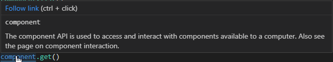

    

    

<h3 align="center">
  OpenComputers Lua
</h3>

    OpenComputers Lua is a VS Code extension to add syntax highlighting, code completion and other useful functions for Open Computers LUA to VS Code.

    

# Table of contents

- [Table of contents](#table-of-contents)
- [Preview Images](#preview-images)
    - [Code Completion](#code-completion)
    - [Syntax Highlighting](#syntax-highlighting)
    - [Reference Link Provider](#reference-link-provider)
- [Changelog](#changelog)
- [References](#references)

# Preview Images

## Code Completion

Code Completion shows what functions are available

No image yet :/

## Syntax Highlighting

## Reference Link Provider

Easy way to access documentation

# Changelog

## v0.1.1 (12/01/2019)

- Fixes Signature help provider

## v0.1.0 (12/01/2019)

- Initial Release

# References
